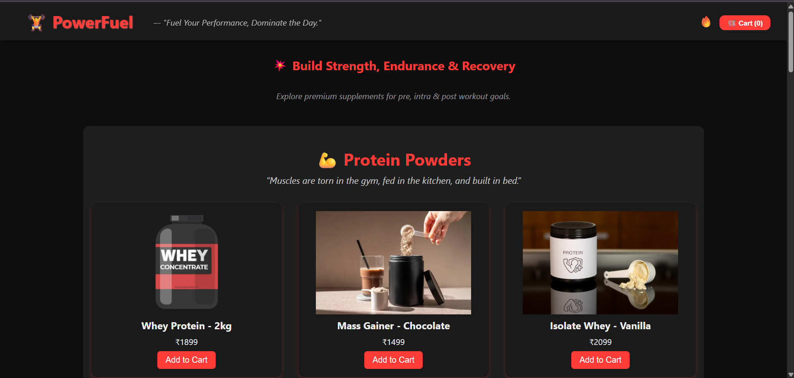
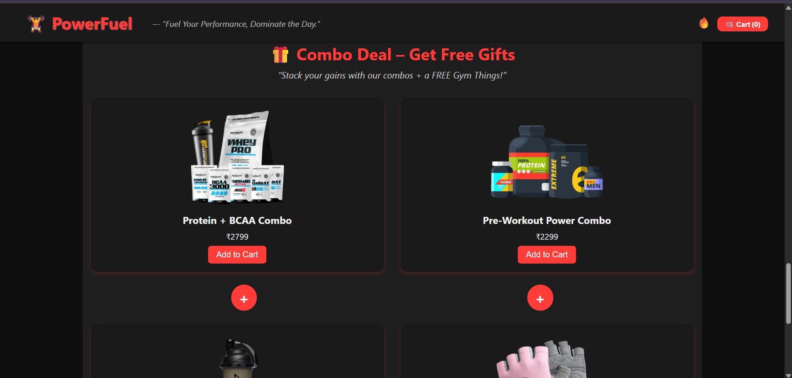
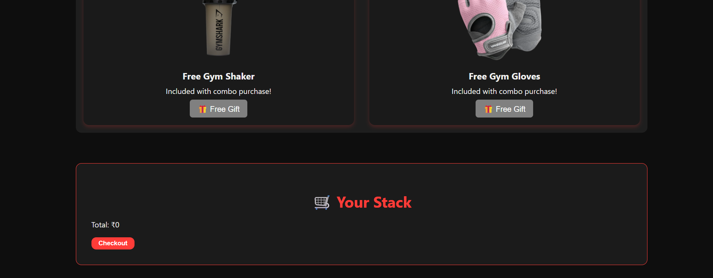
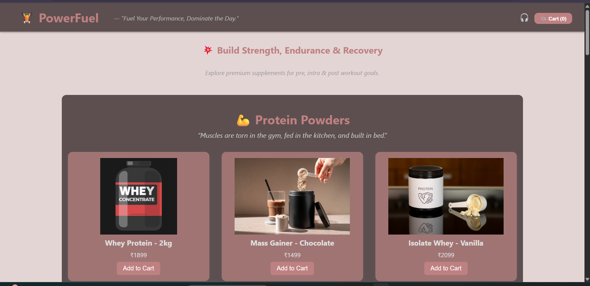

# 🏋️‍♂️ PowerFuel – Gym Gear & Supplements Store

PowerFuel is a gym-themed e-commerce frontend made with HTML, CSS, and JavaScript. It includes dark/brown toggleable themes, emoji branding, and product combos tailored for fitness lovers.

---

## 💪 Features

- 🛒 Add-to-cart system  
- 🎨 Dark + brown-gray theme toggle  
- 🧤 Combo products (e.g., Preworkout + Gloves)   
- 💻 Easy to customize with clean structure

---

## 📸 Screenshots

| Home Page | Product Cards |
|-----------|----------------|
|  |  |

| Cart View | Theme Toggled |
|-----------|----------------|
|  |  |

---

This was for internship Activity.
